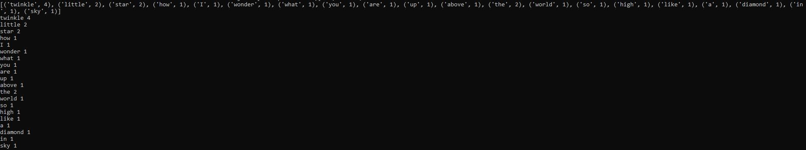
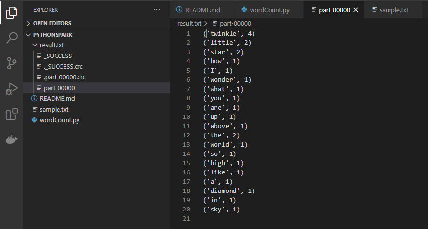

# Python wordCount

## Configuration

Installer [Spark](https://spark.apache.org/downloads.html)

Ajouter le (localisation de spark)/bin dans ses variables d'environnement pour pouvoir utiliser *spark-submit*

## Lancement du projet

Lancer la commande suivante dans le terminal
```
spark-submit .\wordCount.py
```

Le programme va analyser le fichier (sample.txt) et va enregistrer le résultat dans le dossier result

## Terminal


## Résultat du rdd
